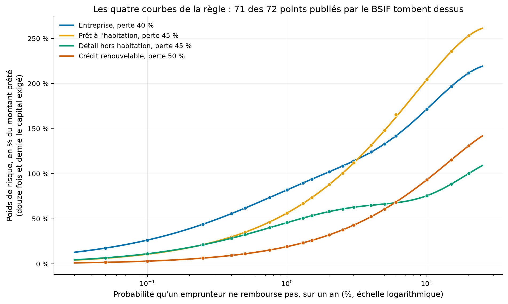
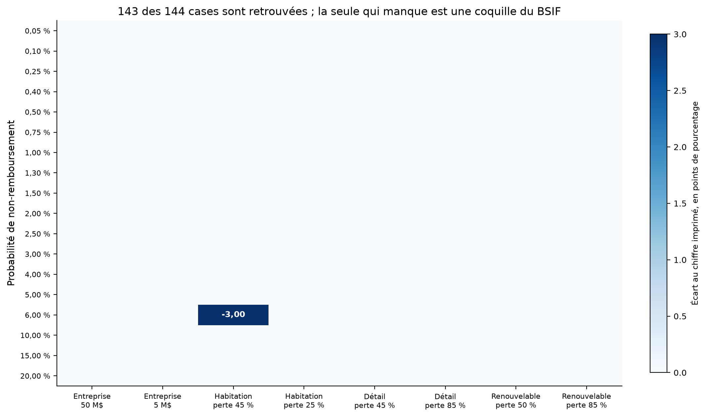
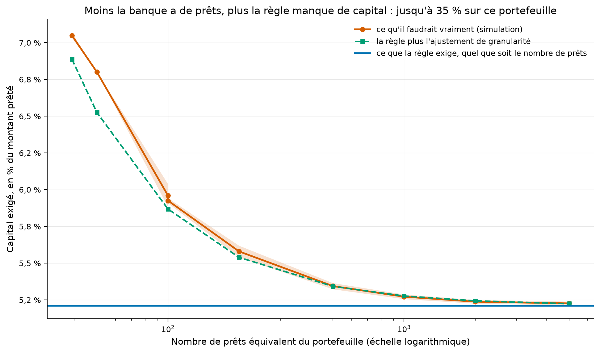
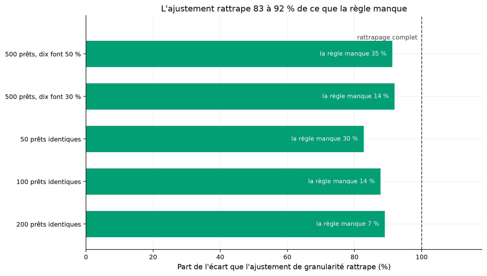
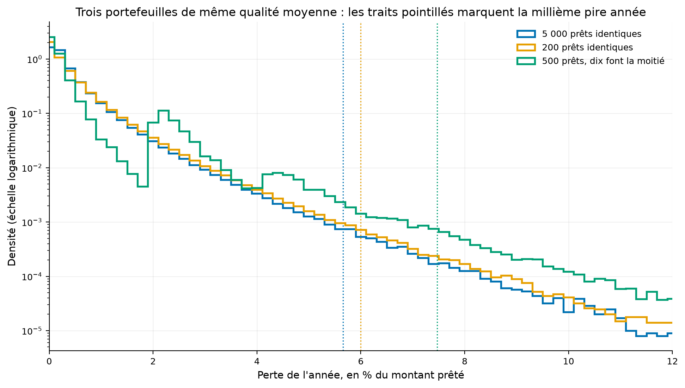

# La règle de capital du BSIF suppose une infinité de prêts : ce que cela coûte

Une banque doit garder de l'argent de côté pour le jour où ses emprunteurs ne remboursent pas. La
règle canadienne calcule cette somme avec une formule qui suppose que la banque prête à une infinité
de tout petits clients. Une banque commerciale, elle, a quelques centaines de dossiers, dont une
poignée de très gros. Ce dépôt mesure ce que l'hypothèse coûte.

[](https://github.com/Guilou001/27-portefeuille-de-credit/actions/workflows/ci.yml)


**Résultat en une phrase.** Sur un portefeuille de 500 prêts dont dix clients font la moitié du
montant, la règle exige **5,21 %** de capital alors qu'il en faudrait **7,05 %**, donc **35 % de
plus que ce qu'elle demande**. Un terme correctif que le comité de Bâle avait proposé en 2001 puis
retiré rattrape **83 à 92 %** de ce manque, sans aucune simulation. Ce 5,21 % est la formule prise
sans son ajustement d'échéance, et la section 3.3 chiffre ce que l'ajouter changerait.

*Summary in English. The Basel/OSFI IRB capital formula assumes an infinitely granular portfolio.
This repository reproduces 143 of the 144 published illustrative risk weights to within one
hundredth of a percentage point. It shows the 144th to be a transcription error by OSFI against the
Basel source. It then measures by simulation how much capital the formula misses on finite
portfolios: a book of 500 loans where ten clients hold half the exposure needs 35 % more capital
than the rule demands, on the formula taken without its maturity adjustment. With that adjustment
the same shortfall is 7.4 %, and both figures are published. The granularity adjustment recovers
83 to 92 % of the shortfall.*

## 1. La question posée

**En mots simples.** Imaginez deux banques qui prêtent le même montant total à des clients de même
qualité. La première a dix mille petits prêts, la seconde en a cinquante gros. Si l'économie va mal,
la première perdra à peu près ce qu'on attend. La seconde peut très bien perdre beaucoup plus, parce
qu'il suffit que deux ou trois de ses gros clients tombent en même temps.

La règle canadienne demande pourtant exactement le même capital aux deux. La question est de
savoir combien cela coûte, et si un correctif simple suffit à réparer.

## 2. D'où vient le projet, et ce qu'il apporte

La règle de capital de crédit repose sur une idée unique : toutes les entreprises d'un pays sont
touchées par une même conjoncture, plus ou moins fortement. Le capital exigé est la perte que la
banque subirait dans une conjoncture si mauvaise qu'elle n'arrive qu'une année sur mille.

Cette formule ne tient que si le hasard propre à chaque emprunteur s'annule dans la moyenne, ce qui
demande une infinité de prêts. Le comité de Bâle le savait : il avait proposé en 2001 un terme
correctif, appelé **ajustement de granularité**, avant de le retirer de la règle finale.

Trois apports.

- **Les 144 poids de risque de l'annexe du BSIF recalculés** depuis les formules du chapitre 5, dont
  143 retrouvés à un centième de point près. Un poids de risque, le pourcentage du montant prêté qui
  sert de base au calcul des fonds propres, vaut douze fois et demie le capital exigé.
- **Deux contradictions relevées dans le document du BSIF**, tranchées en allant lire la table de
  Bâle dont il reprend les chiffres.
- **La mesure de ce que la règle manque**, par simulation, et le test du correctif abandonné.

Aucune donnée n'est téléchargée : tout le dépôt tourne sur des formules et des portefeuilles
construits. Le risque que la source disparaisse est donc nul.

## 3. Les résultats

### 3.1 La règle recalculée : 143 cases sur 144

L'annexe 5-1 du chapitre 5 donne, pour dix-huit niveaux de risque et huit types de prêts, le poids
que la formule doit produire. Ce sont les 144 cases que le code doit retrouver.



Comment lire cette figure : chaque courbe est une famille de prêts, calculée par notre code sur
quatre cents niveaux de risque. L'axe vertical porte le poids de risque, qui vaut douze fois et
demie le capital exigé, et non le capital lui-même. Les points sont les valeurs publiées par le
BSIF, et 71 des 72 tombent sur les courbes. Le soixante-douzième est une coquille, un chiffre mal
recopié d'un document à l'autre. Il passe trois points au-dessus de sa courbe, sur un axe qui en
porte 260, donc l'œil ne l'en sépare pas. La carte de la figure suivante le montre, et la
section 3.2 l'établit.



Comment lire cette figure : une case par valeur de l'annexe, la couleur donne la valeur absolue de
l'écart entre notre calcul et le chiffre imprimé. Cent quarante-trois cases restent au bas de
l'échelle, donc retrouvées à moins d'un centième de point. Une seule n'y reste pas.

### 3.2 Deux contradictions dans le document du BSIF

| Contradiction | Ce que le BSIF imprime | Ce que Bâle imprime | Ce que le calcul donne |
|---|---:|---:|---:|
| Prêt à l'habitation, perte 45 %, risque 6,00 % | 165,52 % | **162,52 %** | **162,52 %** |
| Chiffre d'affaires de la deuxième colonne | 7,5 M$ dans le texte, 5 dans l'en-tête | 5 millions d'euros | 5 |

Comment lire ce tableau, en trois constats. Le premier est que la première ligne est une erreur de
recopie : le comité de Bâle imprime 162,52 %, notre calcul donne 162,52 %, et le BSIF imprime
165,52 %. Un 2 est devenu un 5 lors de la transcription, dans la version de septembre 2025 de la
ligne directrice. Le deuxième est que la seconde ligne est une contradiction interne. Le paragraphe
explicatif du BSIF annonce un chiffre d'affaires de 7,5 millions de dollars, l'en-tête de son propre
tableau annonce 5, et les nombres imprimés sont ceux de 5. Le troisième est que ces deux points se
vérifient par le calcul et non par l'opinion : avec 7,5 millions, **19 cases** de l'annexe seraient
fausses au lieu d'une.

### 3.3 Ce que la règle manque sur un portefeuille fini

Tous les prêts ont ici le même risque, un pour cent de non-remboursement par an, et la même perte en
cas de défaut, 40 %. Seul le nombre de prêts et leur répartition changent.

| Portefeuille | Nombre équivalent | La règle exige | Il en faudrait | Manque, en % de l'exigence | L'ajustement rattrape |
|---|---:|---:|---:|---:|---:|
| 5 000 prêts identiques | 5 000 | 5,21 % | 5,23 % | 0,3 % | trop incertain |
| 2 000 prêts identiques | 2 000 | 5,21 % | 5,24 % | 0,5 % | trop incertain |
| 1 000 prêts identiques | 1 000 | 5,21 % | 5,27 % | 1,2 % | trop incertain |
| 500 prêts identiques | 500 | 5,21 % | 5,34 % | 2,6 % | trop incertain |
| 200 prêts identiques | 200 | 5,21 % | 5,58 % | 7,1 % | 89 % |
| 100 prêts identiques | 100 | 5,21 % | 5,96 % | 14,4 % | 88 % |
| 50 prêts identiques | 50 | 5,21 % | 6,80 % | 30,5 % | 83 % |
| 500 prêts, dix font 30 % | 100 | 5,21 % | 5,93 % | 13,7 % | 92 % |
| **500 prêts, dix font 50 %** | **39** | **5,21 %** | **7,05 %** | **35,3 %** | **91 %** |

La colonne « Manque » rapporte l'écart à ce que la règle exige, et non à ce qu'il faudrait : 35,3 %
veut dire qu'il faudrait 35,3 % de plus que les 5,21 % demandés.

Trois constats se lisent ensuite. Le premier est la colonne du **nombre équivalent** : elle mesure
la concentration, et se lit comme le nombre de prêts égaux qui donnerait le même risque. Cinq cents
prêts dont dix font la moitié du montant se comportent comme trente-neuf prêts égaux, et c'est pour
cela que leur manque de capital est le plus grand du tableau. Le deuxième est que le manque
disparaît quand les prêts sont très nombreux, ce qui confirme que la formule est bien la limite d'un
portefeuille infini et non une approximation de plus. Le troisième est que la dernière colonne se
tait sur les quatre premières lignes. Leur manque y est si petit que la part rattrapée flotte de
plus de cinq points d'un tirage à l'autre, et un nombre qu'on ne sait pas à cinq points près
n'apprend rien. Ce seuil de cinq points est le seul critère de la colonne, et le fichier chiffre
l'incertitude ligne à ligne.

Le tableau n'établit rien au-delà. Tous les prêts y portent le même risque et la même perte en cas
de défaut. Chaque valeur simulée est la moyenne de dix tirages de cinq millions d'années, et leur
dispersion donne l'incertitude publiée.

**Ce que « la règle » désigne ici, et ce que l'autre convention donnerait.** Les 144 cases de la
section 3.1 sont produites avec un ajustement d'échéance de deux ans et demi, celui que l'annexe du
BSIF retient. Le tableau ci-dessus le retire, parce qu'il couvre la dégradation de note, un risque
que la simulation ne modélise pas. Sur le même prêt, les deux exigences diffèrent : 5,21 % sans
l'ajustement, 6,56 % avec. Le manque de la dernière ligne se lit donc de deux façons, 35,3 % de plus
que 5,21 %, ou 7,4 % de plus que 6,56 %. Le signe lui-même peut changer : sur « 500 prêts, dix font
30 % », il en faudrait 9,7 % de moins que ce que la règle avec échéance demande. Les deux colonnes
sont dans `results/capital_par_taille.csv`.



Comment lire cette figure : la ligne bleue horizontale est ce que la règle exige, la même quel que
soit le nombre de prêts. La courbe rouge est ce qu'il faudrait vraiment, avec sa marge d'incertitude
de simulation. La courbe verte est la règle plus le correctif.



Comment lire cette figure : chaque barre est un portefeuille, et sa longueur est la part du manque
que le correctif comble. Les quatre portefeuilles les plus gros sont retirés, parce que sur eux
l'incertitude de simulation laisse cette part flotter de plus de cinq points.



Comment lire cette figure : trois portefeuilles de même qualité moyenne. Les traits pointillés
marquent la millième pire année, celle sur laquelle le capital se calcule. Plus le portefeuille est
concentré, plus la queue de droite s'allonge, alors que le centre de la distribution ne bouge pas.
La courbe verte monte par paliers vers 2 % puis vers 4 % de perte : ce sont ses dix gros clients,
qui valent chacun deux points de perte à eux seuls. Les classes font deux dixièmes de point, le pas
des valeurs que peut prendre la perte du portefeuille le plus grossier.

## 4. La méthode, pas à pas

1. **Écrire la règle** depuis le chapitre 5 : la sensibilité à la conjoncture, l'ajustement de taille
   pour les petites entreprises, l'ajustement d'échéance, et la perte de la millième pire année.
2. **La vérifier** sur les 144 cases publiées.
3. **Simuler un portefeuille fini.** Chaque année tirée a d'abord sa conjoncture, commune à tous. Une
   fois cette conjoncture connue, les emprunteurs font défaut indépendamment les uns des autres : le
   nombre de défauts d'un groupe de prêts identiques suit donc une loi binomiale, et se tire d'un
   seul coup. Mille prêts identiques coûtent alors un tirage, et non mille.
4. **Mesurer l'incertitude de la simulation elle-même**, sans quoi un écart ne prouverait rien.
5. **Appliquer le correctif** et regarder ce qu'il reste.

## 5. Reproduire

```bash
uv sync --locked --all-extras
uv run pytest                 # 20 tests fermés, sans réseau
uv run pcr tout               # les trois calculs et les cinq figures, environ trente-cinq secondes
```

Aucun téléchargement n'est nécessaire. Chaque résultat cité dans ce README se lit dans un fichier
de `results/`. Trois nombres font exception, et aucun n'est un résultat. Le compte de tests est
celui que rend `pytest`, la durée ci-dessus est relevée à l'exécution, et les quatre cents niveaux
de risque de la première figure sont un réglage du code.

## 6. Limites, avec leur statut

| Limite | Statut |
|---|---|
| La simulation ne modélise pas la dégradation de note, seulement le défaut | déclaré ; c'est pourquoi la comparaison se fait sans l'ajustement d'échéance, qui couvre précisément ce risque en plus, si bien que la règle exige 5,21 % ici et 6,56 % à la section 3.1, les deux étant publiés |
| La perte en cas de défaut est prise fixe, alors qu'elle monte dans les mauvaises années | reconnu ; la tenir fixe sous-estime le vrai capital, donc le manque mesuré est un plancher |
| Un seul niveau de risque par portefeuille | déclaré ; mélanger des risques différents ajouterait de la concentration, donc creuserait encore l'écart |
| Les 144 cases du BSIF sont recopiées à la main dans le code | déclaré ; elles sont vérifiées contre la table de Bâle, qui est la source du BSIF |
| L'incertitude de la simulation est mesurée sur dix tirages, et non calculée depuis une formule | mesuré ; elle va de 0,006 à 0,040 point de capital selon la ligne, et tombe à zéro sur cinquante prêts, dont la perte ne peut valoir que des multiples de 0,8 point |
| La part rattrapée n'est publiée que sur cinq des neuf lignes | déclaré ; sur les quatre autres l'incertitude de cette part dépasse cinq points de pourcentage, et la colonne `incertitude_part_pct` du fichier la chiffre |
| Le correctif est implémenté par dérivées numériques et non par sa forme analytique | déclaré ; la forme analytique change dès qu'on modifie la façon dont la sensibilité dépend du risque, la dérivée numérique non |

## 7. Crédits, licence, citation

Ligne directrice sur les normes de fonds propres du Bureau du surintendant des institutions
financières, chapitre 5, version de septembre 2025. Table équivalente du comité de Bâle, CRE 99.
Ajustement de granularité d'après les travaux de Michael Gordy et Tom Wilde. Code sous licence MIT,
rapport sous licence CC BY 4.0. Figures produites par
[gv-fintools](https://github.com/Guilou001/gv-fintools).

Voisinage dans le portefeuille :
[10-credit-bancaire](https://github.com/Guilou001/10-credit-bancaire) porte le modèle qui estime la
probabilité de défaut d'un emprunteur et le dossier de crédit d'une entreprise. C'est le dépôt à
lire pour un poste en banque commerciale. Celui-ci prend la probabilité comme donnée et regarde ce
que la règle en fait au niveau du portefeuille. Le rapport `rapport/rapport.pdf` est engendré depuis
ce README.
